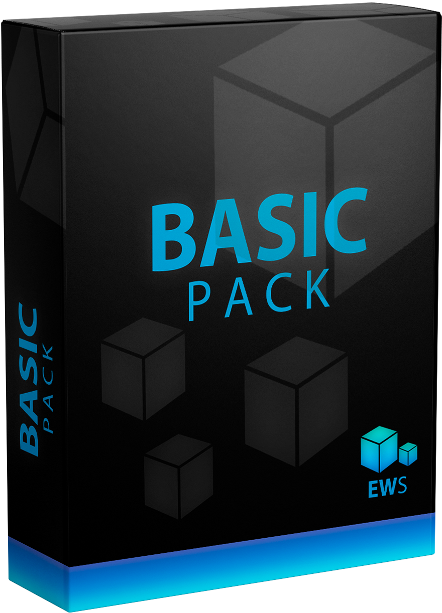

# Scripts de EWS

Estos scripts han sido desarrollados para la empresa ficticia EWS, de la asignatura de Sistemas de Información, para el 2º curso de Ingeniería Informática de la UCO.

Simulan tres diferentes packs de scripts que se venden y que ofrecen diferentes servicios. Los tres scripts son totalmente funcionales, y han sido testados tanto en Ubuntu Server 20.04 como en Ubuntu Server 18.04, asegurándose la máxima compatibilidad en éste último.

**NOTA**: No ejecutar un script tras otro, (p.e: instalar el pack Premium sobre el Basic y viceversa), ya que los scripts pueden fallar. Se recomienda su instalación en máquinas vacías.

 

Los scripts instalan los servicios siguientes:

|   Software incluído     |        BASIC       |       MEDIUM       |   PREMIUM          |
|:-----------------------:|:------------------:|:------------------:|:------------------:|
| Apache                  | :white_check_mark: | :white_check_mark: | :white_check_mark: | 
| mySQL                   | :white_check_mark: | :white_check_mark: | :white_check_mark: | 
| PHPmyAdmin              | :white_check_mark: | :white_check_mark: | :white_check_mark: |
| Odoo                    |          -         | :white_check_mark: | :white_check_mark: | 
| Asterisk                |          -         |         -          | :white_check_mark: | 
| Prestashop              | :white_check_mark: | :white_check_mark: | :white_check_mark: | 
| Wordpress               | :white_check_mark: | :white_check_mark: | :white_check_mark: | 
| Moodle                  |          -         | :white_check_mark: | :white_check_mark: | 

Puede acceder a los diferentes packs desde aquí
- [Pack BASIC][BASIC]
- [Pack MEDIUM][MEDIUM]
- [Pack PREMIUM][PREMIUM]

[BASIC]: /BASIC
[MEDIUM]: /MEDIUM
[PREMIUM]: /PREMIUM

## Licencia
El contenido de este repositorio está sujeto bajo una licencia [Boost Software License 1.0](LICENSE)
